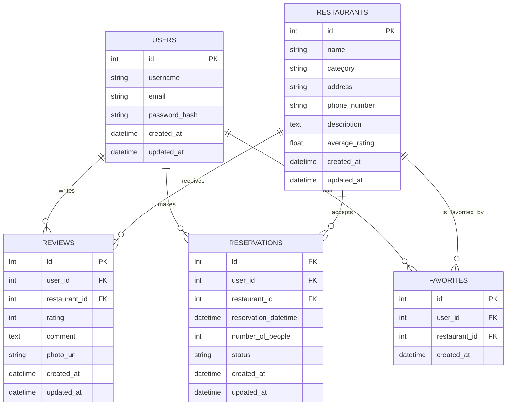

# テーブル定義書

## ER図

```mermaid
erDiagram
    USERS ||--o{ REVIEWS : writes
    USERS ||--o{ RESERVATIONS : makes
    USERS ||--o{ FAVORITES : has
    RESTAURANTS ||--o{ REVIEWS : receives
    RESTAURANTS ||--o{ RESERVATIONS : accepts
    RESTAURANTS ||--o{ FAVORITES : is_favorited_by

    USERS {
        int id PK
        string username
        string email
        string password_hash
        datetime created_at
        datetime updated_at
    }

    RESTAURANTS {
        int id PK
        string name
        string category
        string address
        string phone_number
        text description
        float average_rating
        datetime created_at
        datetime updated_at
    }

    REVIEWS {
        int id PK
        int user_id FK
        int restaurant_id FK
        int rating
        text comment
        string photo_url
        datetime created_at
        datetime updated_at
    }

    RESERVATIONS {
        int id PK
        int user_id FK
        int restaurant_id FK
        datetime reservation_datetime
        int number_of_people
        string status
        datetime created_at
        datetime updated_at
    }

    FAVORITES {
        int id PK
        int user_id FK
        int restaurant_id FK
        datetime created_at
    }
```

