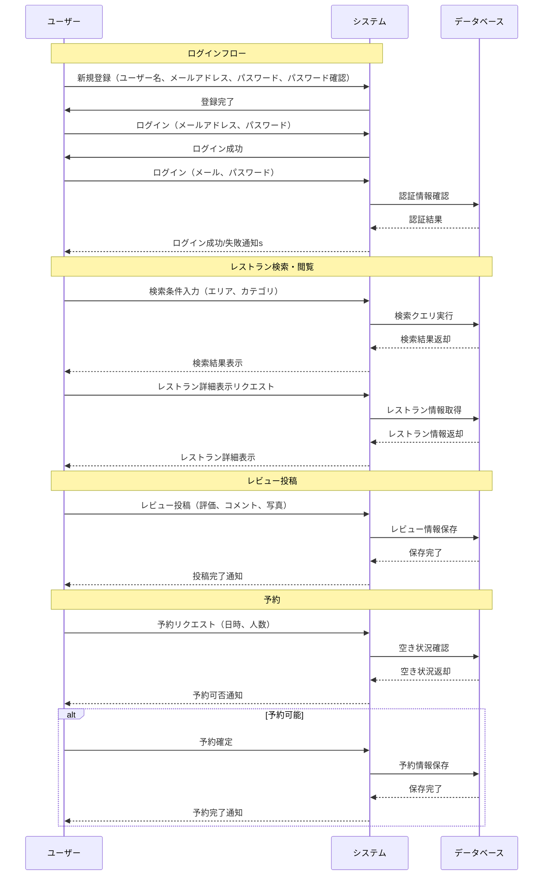

# 業務フロー
## **ユーザー**

```mermaid
sequenceDiagram
    participant ユーザー as ユーザー
    participant システム as システム
    Note over ユーザー,システム: ログインフロー
    ユーザー->>システム: 新規登録（ユーザー名、メールアドレス、パスワード、パスワード確認）
    システム->>ユーザー: 登録完了
    ユーザー->>システム: ログイン（メールアドレス、パスワード）
    システム->>ユーザー: ログイン成功
    actor ユーザー
    participant データベース

    ユーザー->>システム: ログイン（メール、パスワード）
    システム->>データベース: 認証情報確認
    データベース-->>システム: 認証結果
    システム-->>ユーザー: ログイン成功/失敗通知s

    Note over ユーザー,データベース: レストラン検索・閲覧
    ユーザー->>システム: 検索条件入力（エリア、カテゴリ）
    システム->>データベース: 検索クエリ実行
    データベース-->>システム: 検索結果返却
    システム-->>ユーザー: 検索結果表示

    ユーザー->>システム: レストラン詳細表示リクエスト
    システム->>データベース: レストラン情報取得
    データベース-->>システム: レストラン情報返却
    システム-->>ユーザー: レストラン詳細表示

    Note over ユーザー,データベース: レビュー投稿
    ユーザー->>システム: レビュー投稿（評価、コメント、写真）
    システム->>データベース: レビュー情報保存
    データベース-->>システム: 保存完了
    システム-->>ユーザー: 投稿完了通知

    Note over ユーザー,データベース: 予約
    ユーザー->>システム: 予約リクエスト（日時、人数）
    システム->>データベース: 空き状況確認
    データベース-->>システム: 空き状況返却
    システム-->>ユーザー: 予約可否通知
    alt 予約可能
        ユーザー->>システム: 予約確定
        システム->>データベース: 予約情報保存
        データベース-->>システム: 保存完了
        システム-->>ユーザー: 予約完了通知
    end
```
