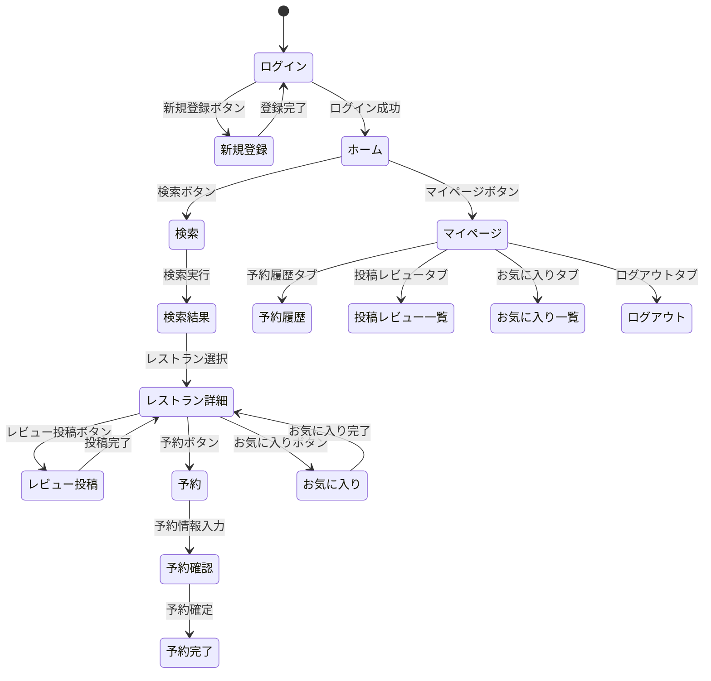

# 画面遷移図

```mermaid
stateDiagram-v2
    [*] --> ログイン
    ログイン --> 新規登録 : 新規登録ボタン
    新規登録 --> ログイン : 登録完了
    ログイン --> ホーム : ログイン成功

    ホーム --> 検索 : 検索ボタン
    検索 --> 検索結果 : 検索実行
    検索結果 --> レストラン詳細 : レストラン選択

    レストラン詳細 --> レビュー投稿 : レビュー投稿ボタン
    レビュー投稿 --> レストラン詳細 : 投稿完了

    レストラン詳細 --> 予約 : 予約ボタン
    予約 --> 予約確認 : 予約情報入力
    予約確認 --> 予約完了 : 予約確定

    レストラン詳細 --> お気に入り : お気に入りボタン
    お気に入り --> レストラン詳細 : お気に入り完了
    
    ホーム --> マイページ : マイページボタン
    マイページ --> 予約履歴 : 予約履歴タブ
    マイページ --> 投稿レビュー一覧 : 投稿レビュータブ
    マイページ --> お気に入り一覧 : お気に入りタブ
    マイページ --> ログアウト : ログアウトタブ
```
